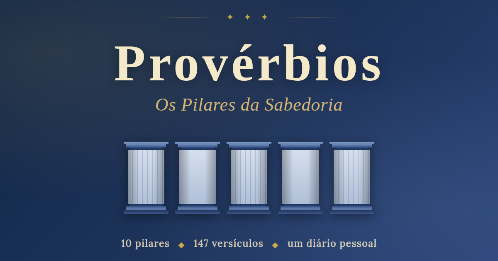

# Provérbios — Os Pilares da Sabedoria

> Um devocional digital que organiza o livro bíblico de Provérbios em 10 blocos temáticos ("pilares"), com versículo diário, referências cruzadas com o Novo Testamento e um diário pessoal de reflexões.

**🔗 Acesse:** https://rafaelevangelista1984.github.io/Proverbios/

---

## Os 10 Pilares

| | Pilar | Versículos |
|---|---|---|
| I | Temor do Senhor e Sabedoria | 12 |
| II | Trabalho e Diligência | 13 |
| III | Dinheiro, Riquezas e Generosidade | 12 |
| IV | Casamento e Fidelidade | 17 |
| V | Filhos, Educação e Disciplina | 10 |
| VI | A Língua e o Poder das Palavras | 12 |
| VII | Amizades e Companhias | 9 |
| VIII | Domínio Próprio | 21 |
| IX | Integridade e Justiça | 20 |
| X | Prudência e Liderança | 21 |

Total: **147 versículos** organizados, **141 referências cruzadas** com o Novo Testamento.

---

## Funcionalidades

- ✦ **Versículo do dia** — um de cada pilar, renovado diariamente
- ✦ **Pilares como colunas clássicas** — visualização em colunas arquitetônicas
- ✦ **Eco no Novo Testamento** — paralelos do NT para cada versículo aplicável
- ✦ **Links para a Bíblia Online** — leia o capítulo inteiro com um toque
- ✦ **Diário pessoal** — anote suas reflexões em cada versículo
- ✦ **Exportação em JSON** — backup das suas anotações
- ✦ **Lembrete de backup** — alerta automático quando faz tempo desde o último export
- ✦ **Responsivo** — funciona bem em celular, tablet e desktop
- ✦ **Offline-ready** — após o primeiro carregamento, funciona sem internet

---

## Tecnologia

HTML, CSS e JavaScript puros — sem frameworks, sem dependências de build. Fontes do Google Fonts (Cinzel, Lora, Cormorant Garamond). Hospedado gratuitamente no GitHub Pages.

## Privacidade

As anotações ficam armazenadas no `localStorage` do navegador do usuário. **Não são enviadas para nenhum servidor.** Cada visitante tem seu próprio diário, privado e local. Para fazer backup, use o botão "Exportar (.json)" na aba Anotações.

---

## Tradução utilizada

Os versículos seguem a tradução **Almeida Corrigida Fiel (ACF)**, em domínio público em sua versão tradicional. Os links para consulta apontam para [Bíblia Online](https://www.bibliaonline.com.br/acf).

---

*Que o temor do Senhor seja o princípio do seu conhecimento.* — **Pv 1:7**
